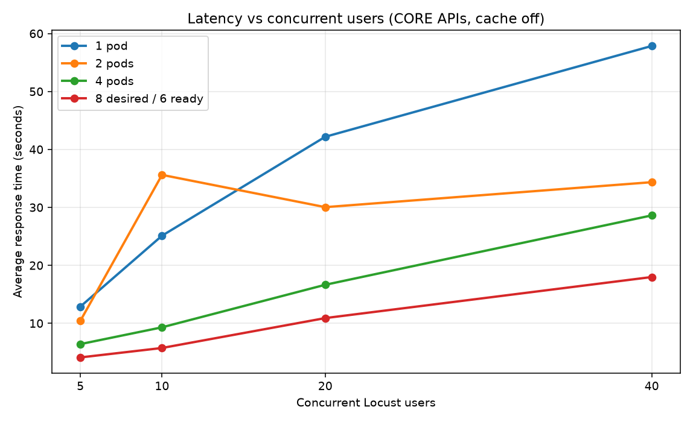
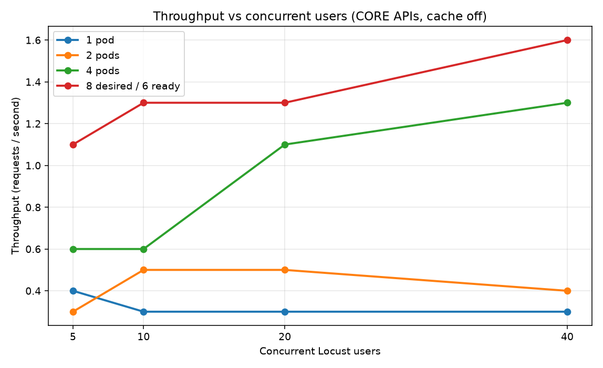

# SmartPark Benchmark Report (FIT3184 A1 §6)

Locust 2.32.6 against GKE LoadBalancer `http://34.129.33.23` on 16 Sep 2026. Cache off (`CACHE_TTL_SECONDS=0`). Each replica count ran 280 s at 5, 10, 20, then 40 users. Tasks: `GET /api/find-carparks?n=3` (weight 5) and `GET /api/annotate-carpark` (weight 1).

## 1. Results table

| Ready / desired pods | Max users (<1% errors) | Mean latency (s) | Throughput (req/s) |
|---|---:|---:|---:|
| 1 / 1 | 40 | 35.3 | 0.32 |
| 2 / 2 | 40 | 30.6 | 0.41 |
| 4 / 4 | 40 | 17.0 | 0.88 |
| 6 / 8 | 40 | 10.9 | 1.29 |

Forty users stayed under 1% HTTP errors in every run (one 502 at two pods). Eight replicas were requested; only six became Ready — three `e2-standard-4` nodes cannot place eight pods that each request 1000 mCPU plus a FUSE sidecar.

Stage-wise mean latency (seconds):

| Users | 1 pod | 2 pods | 4 pods | 6/8 pods |
|---:|---:|---:|---:|---:|
| 5 | 12.9 | 10.4 | 6.4 | 4.1 |
| 10 | 25.1 | 35.6 | 9.3 | 5.7 |
| 20 | 42.2 | 30.0 | 16.6 | 10.9 |
| 40 | 57.9 | 34.3 | 28.6 | 18.0 |

## 2. Plots

Figures 1 and 2 (next page) plot latency and throughput versus users.

## 3. Performance analysis

Unloaded `find-carparks` (n=2) took 2.58 s of YOLO time. Each call queries `2n` cameras then serialises `model.predict` on `asyncio.Semaphore(1)`, so one pod runs one inference at a time. Extra users wait: one-pod mean latency rose from 13 s at 5 users to 58 s at 40. Horizontal scaling copies that worker. Mean latency at 40 users fell 35.3 → 17.0 → 10.9 s from 1 → 4 → 6 ready pods; throughput rose 0.32 → 0.88 → 1.29 req/s (2.8× and 4.0×). Scaling is sub-linear because the camera Service stayed at one replica, Firestore is shared, each process still serialises, and Locust’s 1–3 s wait plus multi-second inference keeps pods busy. The 2-pod/10-user 35.6 s point is an outlier (one 125 s request).

Primary bottleneck: CPU-bound Ultralytics `predict` plus Semaphore(1). Mitigations: smaller CPU requests or larger nodes so eight pods schedule; two uvicorn workers per 2-vCPU limit; a short inference cache; scale the camera Deployment with the API.

## 4. Cost analysis

Project `smartpark-508006`, zonal cluster `smartpark-cluster` (`australia-southeast2-a`), created 9 Sep 2026. Compute operations show ~167 e2-standard-4 VM-hours (one node almost continuously, plus ~1 h of extra nodes today). SKUs: Melbourne e2-standard-4 $0.1616/h; 50 GB pd-balanced boot disks; GKE $0.10/h.

| Item | Estimate (USD) |
|---|---:|
| 167 VM-hours × $0.1616 | $27.0 |
| Boot disks | $1.5 |
| LoadBalancer / IP | $1.5 |
| GCS FUSE, Artifact Registry, Firestore | <$0.5 |
| GKE fee 166 h × $0.10 (free-tier credit likely) | $0 / $16.6 |
| **Total with GKE free tier** | **~$30** |
| **Total if cluster fee is billed** | **~$47** |

This is above the $20 guideline. Confirm Billing account `01C867-4FAD17-B8FFE7`. API replicas were returned to 1 after the run.

**20-minute demo** on two nodes: 0.33 × 2 × $0.1616 ≈ **$0.11** (plus ~$0.03 if the cluster fee is billed). One node is enough for a walkthrough (~$0.05). Three idle `e2-standard-4`s cost ~$11.6/day — scale the node pool back to 1 when idle.
